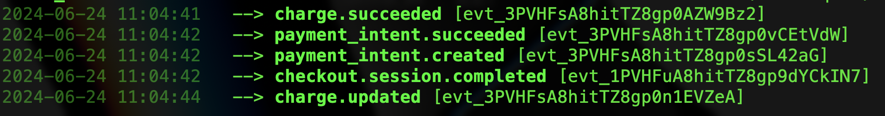
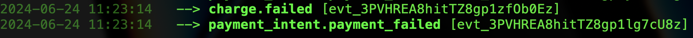

# 1. Distinctiveness and Complexity
Defence: Why you believe your project satisfies the distinctiveness and complexity requirements, mentioned above
1. This project is an e-commerce website. The uniqueness of this website is that it includes all lesson contents combined such as: commerce, social network and email system
2. Furthermore, it's added some new features such as: integration with a third-party Stripe payment; usage of prescriptive data analysis to display its trend of the popular products based on the dataset from the users's input
3. Complexity: Regarding its complexity, the website has included the automatic email sent to user when their transaction is a success. At this point, the Stripe payment transaction and the built email system must collaborate together to ship the end outcome.   
   
# 2. File Contents: .html, .py, .js Extensions

__**html:**__

1. `admin_product.html` 
  - displayed all current products encompassing the CRUD operations. 
  - added Pagination functionality at the end of the page
2. `admin_user.html` showed registered users excluding the admin person
3. `home_products.html` 
  - displayed all products currently in the system
  - added a checkbox functionality to filter out the products

__**py:**__


__**js:**__
# 3. How to run your application
1. Create a virtual environment named as final_env: 
   ```python
   $ pip -m venv final_env
   ```
2. Activate the virtual environment: 
   ```python
   $ source ./final_env/bin/activate
   ```
3. Direct to your current working directory, then clone this app: 
   ```python
   $ git clone https://github.com/hon-nova/eCoffee
   ```
4. Start the Django development server by executing the command:
   ```python
   $ python3 manage.py runserver
   ```
5. Use `pip` to create a requirements.txt file: 
   ```python
   $ pip freeze > requirements.txt
   ```
6. **__Applied credentials:__**<br/>
   
   |                    | username      | password    |
   |     --------       | --------      | -------     |
   | user route         | hon           | useruser11  |
   | admin route        | hon-admin     | useruser11  |
   | Django admin route | hon-admin     | useruser11  |
  

# 4. Supplementary information about the project

1.  The email address the user used to register for this website is considered the main vehicle used for communication with this user by the admin or a sales person
2.  The app does use other Bootstrap libraries for collapsible task as shown
  ```js
  <script src="https://code.jquery.com/jquery-3.5.1.slim.min.js"></script>
  <script src="https://cdn.jsdelivr.net/npm/@popperjs/core@2.9.2/dist/umd/popper.min.js"></script>
  
  ```   
# 5. Python Libraries used:

 ```python
   pip install plotly
   pandas
   numPy
```
1. Install Stripe
   ```python
   pip install stripe
   ```
2. Install Stripe CLI globally
   ```python
   $ brew install stripe/stripe-cli/stripe  
   ```
3. Run your terminal shell to get the Stripe webhook secret(s)
   ```python
    $ stripe login
    $ stripe listen --forward-to localhost:8080/webhook/
   ```
4. Stripe Event Packages
   ```
   payment_intent.succeeded
   payment_intent.payment_failed
   ```
   **__Use Cases__**

   **success**

   

   **failure**

   

5. Other packages for deployment purposes
   ```python   
   pip install python-dotenv
   ```
# 6. Agile User Stories:
1. As a visitor, I can surf the website and look for products that I want
2. As a registered user, I can
   - Save items in my cart for future purchase.
   - Remove unwanted items from my cart
   - Add items to my cart
   - View all items in my cart before and after completing a transaction
   - Conduct online transactions
   - Contact sales representatives via email for any complaints
   - Interact with the chatbot to check the status of my current order
   - Review my purchase history
   - Write product reviews
Indicate preferences by liking or disliking a product.
1. As an admin person or a general manager, I can
    - Access and review all current registered users' purchase histories and account information (excluding passwords)
   - View all available products
   - Perform all CRUD (Create, Read, Update, Delete) operations on products

# 7. Constraints:
1. The implementation of the `like` icon in product_details.html is currently not fully effective in handling multiple clicks on a particular product. To revert the like icon to its original state, users may need to refresh the page.
2. 