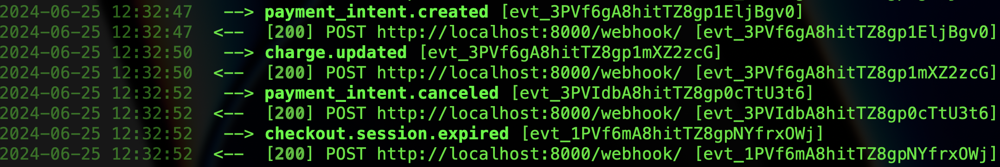

# 1. Distinctiveness and Complexity
**Distinctiveness:**

   This project is an e-commerce website dedicated to selling coffee online, which allows registered users to make purchases via Stripe payment. The distinctiveness of this website is demonstrated through the integration of various comprehensive features that go beyond basic e-commerce functionalities:

   1. Full-Stack Development: The project showcases a complete full-stack development approach, integrating both frontend and backend components seamlessly.
   2. Diverse Features: It incorporates multiple lessons and components learned throughout the course, such as product management, user authentication, and dynamic content rendering. Specific features include:
      - Product Like/Unlike Option: Users can like or unlike products, adding an interactive element to the user experience.
      - Stripe Payment Integration: Secure and reliable payment processing through Stripe, enhancing user trust and transaction safety.
      - User Purchase History: Registered users can view their purchase history, providing a personalized shopping experience.
      - Admin Dashboard: A robust admin interface that allows administrators to manage products, view sales data, and generate reports.
**Complexity:**
   The project’s complexity is evident through the following advanced features and implementations:
   1. Sales Reporting: The website includes functionality to generate detailed sales reports, accessible through the admin dashboard. This feature leverages data aggregation and visualization techniques to provide insights into sales performance.
   2. User Profiles and Orders Management: The site allows users to manage their profiles and view all past orders, integrating complex querying and data retrieval processes.
   3. Custom User Authentication: Implementation of a custom user authentication system using AbstractUser, enhancing security and allowing for extended user functionalities.
   4. Cart and Order Management: The project includes comprehensive cart and order management systems, enabling users to add items to their cart, adjust quantities, and proceed to checkout seamlessly.
   5. Responsive Design: The frontend is designed to be fully responsive with Bootstrap support features, ensuring a smooth user experience across different screen sizes.
   
# 2. File Contents: .html, .py, .js Extensions

__**html:**__

A) User Route:
1. `index.html`   
2. `home_products.html` 
     - displayed all products currently in the system
     - added a checkbox functionality to filter out the products
3. `cart.html`
4. `create_checkout_session.html`
5. `success_transaction.html`
6. `failure_transaction.html`
7. 
8. `product_details.html`
9.  `profile.html`
B) Admin Route:    
1.  `admin_products.html` 
      - displayed all current products encompassing the CRUD operations 
      - added Pagination functionality at the end of the page
2.  `admin_user.html` showed all registered users excluding the admin person

__**py:**__
1. `admin.py`:
      - This file registers the `User, Product, Cart, CartItem, Like, and Order` models with the Django admin site. As a result, these models can be managed via the Django admin interface, allowing administrators to view, add, modify, and delete instances of these models through a web-based interface.
2. `context_processors.py`
      - Defines a context processor function `send_cart_length` that provides cart-related information to all **templates**. Specifically, it adds the total number of items in the cart (cart_length) and the total price of the items in the cart (total) to the context. This function is registered in the settings.py as follows
  
      ```python
            'context_processors': [
                ...
                'eCoffee.context_processors.send_cart_length'
            ],
      ```
3. `forms.py`
      - The forms.py file defines a ProductForm class that inherits from forms.ModelForm. This form is used to create or update instances of the Product model.

      - The Meta class within ProductForm specifies that the form is based on the Product model.
      The form includes the fields `description, category, price, quantity, and photo_url` from the `Product` model. The Django form itself serves as a `Constructor` of the `Product` class.
4. `models.py`
      - Consists of core models of the backbone project
      - `User`: Extends AbstractUser with no additional fields
      - `Product`: Represents a product with a description, category (choices provided), price, quantity, photo URL, and creation timestamp
      - `Like`: Tracks which users like which products, with a unique constraint on the user-product pair
      - `Cart`: One-to-one relationship with User, includes methods to get total items and total price
      - `CartItem`: Represents items in a cart, linked to Cart and Product, with a quantity field
      - `Order`: Linked to Cart, includes fields for payment status, order placement timestamp, payment intent ID, amount, and a method to get the total payment.
5. `urls.py`
      - This urlpatterns list defines the routing paths for URLs in a Django application:
  
   |       url                 | description                                                         | 
   |     --------              | ----------                                                          | 
   |         ''                | Points to views.index for the root URL, typically the homepage       | 
   | "accounts/login/"         | Links to views.login_view for user login functionality        |
   | "logout"                  | Connects to views.logout_view for user logout        | 
   | "register"                |  Routes to `views.register` for user registration |
   | "coffee_admin"            |Directs to views.main_dashboard for the main administrative dashboard|
   | "coffee_admin/products"   |Maps to views.admin_products for managing products in the admin dashboard|
   | "get_product/<int:product_id>"|Fetches a specific product using views.get_product based on its ID|
   | "coffee_admin/users"      |Points to views.admin_users for viewing user accounts in the admin dashboard|
   | "home_products"           |Points to the products page                   |
   | "delete_product"          |Routes to views.delete_product for deleting a product|
   | "product_details/<int:product_id>" | Shows details of a specific product using views.product_details|
   | "save_product"            | Connects to views.save_product for saving product details|
   | "cart_items"              | Links to views.cart_items for managing items in the shopping cart|
   | "cart/<int:product_id>"   | Adds a product to the cart using views.add_to_cart based on its ID|
   | "cart_items/<int:item_id>"|Deletes an item from the cart using views.cart_delete_item based on its ID |
   |"update_cart_item/<int:product_id>" |Updates the quantity of an item in the cart using views.update_cart_item based on its ID|
   | "create_checkout_session/"| Initiates a checkout session using views.create_checkout_session|
   |"success_transaction/" |Displays a success message for a completed transaction using views.success_transaction |
   | "failure_transaction/"| Displays a failure message for a failed transaction using views.failure_transaction|
   | "profile/<int:user_id>"| Shows the profile of a user using views.profile based on their ID|
   | "likes/<int:product_id>"| Handles toggling of product likes using views.toggle_like based on the product's ID|
   |"webhook/"                | Handles webhook events from Stripe using views.stripe_webhook|
6. `views.py`
      - The views.py file in a Django application serves as the backbone, defining various view functions that handle different aspects of the application's functionality. Each view function is responsible for processing requests, interacting with the database through models, and rendering appropriate responses or templates to users. All functions are defined as follows:
  

   |Name|Function|Description|
   |----|--------|------------|
   |Index View|`index`|Renders the homepage of the application| 
   |**Authentication Views**|||
   |Login View|`login_view`|Handles user authentication and renders the login page|
   |Logout View|`logout_view`|Logs out the user and redirects to the homepage|
   |Register View|`register`|Manages user registration and renders the registration form|
   |**Admin Dashboard Views**|||
   |Main Dashboard|`main_dashboard`|Renders the main administrative dashboard|
   |Admin Products|`admin_products`|Manages products within the administrative interface|
   |Admin Users|`admin_users`|Manages user-related tasks within the administrative interface|
   |**Product Views**|||
   |Get Product|`get_product`|Retrieves and displays details of a specific product|
   |Delete Product|`delete_product`|Deletes a product from the database|
   |Product Details|`product_details`|Shows detailed information about a product|
   |Save Product|`save_product`|Handles the creation or update of product information|
   |**Cart Views**|||
   |Cart Items|`cart_items`|Manages items in the user's shopping cart|
   |Add to Cart|`add_to_cart`|Adds a product to the user's cart|
   |Cart Delete Item|`cart_delete_item`|Removes an item from the user's cart|
   |Update Cart Item|`update_cart_item`|Updates the quantity of an item in the user's cart|
   |**Checkout Views**|||
   |Create Checkout Session|`create_checkout_session`|Initiates a checkout session for payment processing|
   |Success Transaction|`success_transaction`|Displays a success message after a successful transaction|
   |Failure Transaction|`failure_transaction`|Displays a failure message after an unsuccessful transaction|
   |**Profile View**|`profile`|Renders and manages user history purchases information|
   |**Like View**|`toggle_like`|Handles toggling of product likes by users|
   |**Webhook Terminal**|`stripe_webhook`|Handles webhook events from Stripe for payment notifications and updates|


__**js:**__
1. `index.js`
      - This script is responsible for handling the `like` functionality on an e-commerce website. When a user clicks a like button for a product, it sends a request to the server Django to update the `like` status. Depending on the response, it updates the UI to reflect whether the product is liked or not by toggling a liked class on the corresponding `heart` icon. The script includes error handling to log any issues that occur during the process.
# 3. How to run your application
1. Create a virtual environment named as final_env: 
   ```python
   $ pip -m venv final_env
   ```
2. Activate the virtual environment: 
   ```python
   $ source ./final_env/bin/activate
   ```
3. Direct to your current working directory, then clone this app: 
   ```python
   $ git clone https://github.com/hon-nova/eCoffee
   ```
4. Start the Django development server by executing the command:
   ```python
   $ python3 manage.py runserver
   ```
5. Use `pip` to create a requirements.txt file: 
   ```python
   $ pip freeze > requirements.txt
   ```
6. **__Applied credentials:__**<br/>
   
   |                    | username      | password    |
   |     --------       | --------      | -------     |
   | user route         | hon           | useruser11  |
   | admin route        | hon-admin     | useruser11  |
   | Django admin route | hon-admin     | useruser11  |
  

# 4. Supplementary information about the project

1.  The email address the user used to register for this website is considered the main vehicle used for communication with this user by the admin or a sales person
2.  The app does use other Bootstrap libraries for collapsible task as shown
  ```js
  <script src="https://code.jquery.com/jquery-3.5.1.slim.min.js"></script>
  <script src="https://cdn.jsdelivr.net/npm/@popperjs/core@2.9.2/dist/umd/popper.min.js"></script>
  
  ```   
# 5. Python Libraries used:

 ```python
   pip install plotly
   pandas
   numPy
```
1. Install Stripe
   ```python
   pip install stripe
   ```
2. Install Stripe CLI globally
   ```python
   $ brew install stripe/stripe-cli/stripe  
   ```
3. Run your terminal shell to get the Stripe webhook secret(s)
   ```python
    $ stripe login
    $ stripe listen --forward-to localhost:8080/webhook/
    $ stripe listen --forward-to localhost:8080/success_transaction/
    $ stripe listen --forward-to localhost:8080/failure_transaction/
   ```
4. Stripe Event Packages
   ```
   payment_intent.succeeded
   payment_intent.payment_failed
   ```
   **__Use Cases__**

   **success**

   

   **failure**

   

5. Other packages for deployment purposes
   ```python   
   pip install python-dotenv
   ```
# 6. Agile User Stories:
1. As a visitor, I can surf the website and look for products that I want
2. As a registered user, I can
   - Save items in my cart for future purchase.
   - Remove unwanted items from my cart
   - Add items to my cart
   - View all items in my cart before and after completing a transaction
   - Conduct online transactions
   - Contact sales representatives via email for any complaints
   - Interact with the chatbot to check the status of my current order
   - Review my purchase history
   - Write product reviews
Indicate preferences by liking or disliking a product.
1. As an admin person or a general manager, I can
    - Access and review all current registered users' purchase histories and account information (excluding passwords)
   - View all available products
   - Perform all CRUD (Create, Read, Update, Delete) operations on products

# 7. Constraints:
1. The implementation of the `like` icon in product_details.html is currently not fully effective in handling multiple clicks on a particular product. To revert the like icon to its original state, users may need to refresh the page.
2. 